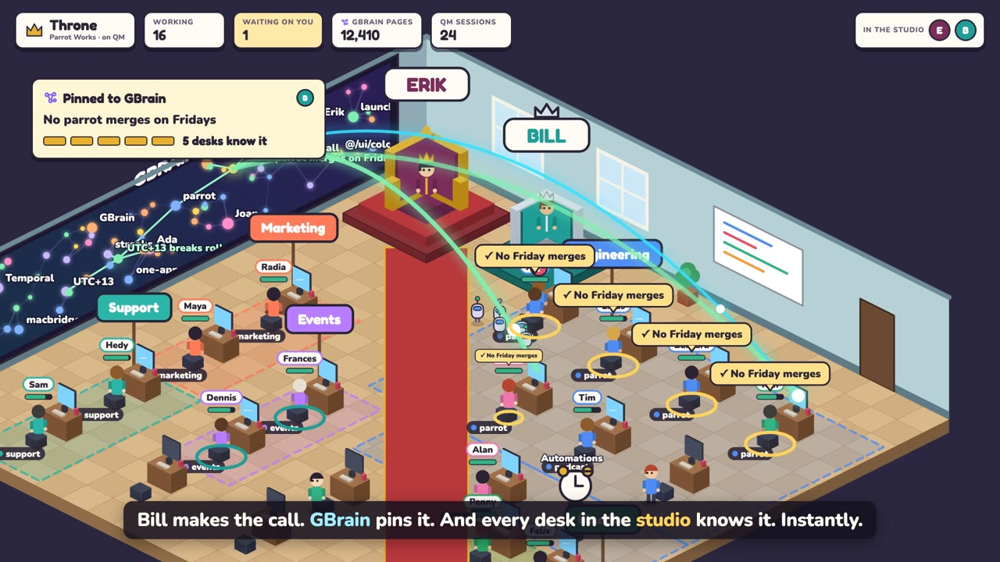

# Throne Room

**Run your company from a throne: real QM agents bring you proof, share one GBrain, and teammates rule beside you.**

[](https://parrotspace.sfo3.digitaloceanspaces.com/hackathon/throne/v3/throne-demo-v3.mp4)

▶ **[Watch the demo (2:36, 1080p)](https://parrotspace.sfo3.digitaloceanspaces.com/hackathon/throne/v3/throne-demo-v3.mp4)**, or play [`media/throne-demo.mp4`](media/throne-demo.mp4) from this repo.
Built at YC's Own Your Intelligence hackathon. Clips labeled **REAL** are the live app on the QM fork; the other scenes are rendered from the product design.

Sit on a throne in an isometric office. Every worker is a real agent session: a **QM** session (the org harness, with its own sandbox) or a local **Claude** / **Codex** coding desk in its own git worktree. Workers walk up the carpet to ask questions and present proof. The whole studio shares one **GBrain**, drawn live on the left wall: every recall beams from a page to a desk, every finished task becomes a new page, and a rule you teach is pinned and spreads desk by desk.

## Try it yourself (about 10 minutes)

The repo ships a mock company, **Parrot Works** ([`examples/parrot-works`](examples/parrot-works)). It has 78 GBrain pages (people, projects, decisions, lessons, playbooks, reference), plus standing rules, areas and demo tasks in `company.json`. All of it is fictional demo data: made-up people, numbers and incidents. On first boot it loads into a fresh GBrain in about 2 seconds, so the wall, recall, playbooks and rules work right away.

**Requires:** Node 20+, [Bun](https://bun.sh), Docker, and a Codex (ChatGPT) or Claude login.

```bash
# 1. GBrain, the shared memory (the CLI Throne talks to)
bun install -g github:garrytan/gbrain

# 2. QM, the org harness every worker runs on (local, Docker-backed)
git clone https://github.com/yc-software/qm ~/dev/qm && cd ~/dev/qm && npm install
for k in CORE_SIGNING_SECRET CAPABILITY_SECRET PORTAL_IDENTITY_SECRET CONNECTOR_SECRET_KEY PORTAL_SESSION_SECRET; do echo "$k=$(openssl rand -hex 32)"; done > .env
codex login                                   # workers use your ChatGPT login
npm run sandbox:local:build                   # once: the Docker image QM workers run in
HARNESS=codex npm run dev-instance:web        # core :8081, admin :8129/admin

# 3. Throne
git clone https://github.com/erikd234/throne-room && cd throne-room && npm install
npm start                                     # http://localhost:4777
```

Throne reads QM's secrets from `~/dev/qm/.env` (set `QM_DIR` if QM lives elsewhere). A fresh studio uses `THRONE_HOME=$(mktemp -d) npm start`. `npm run reset:brain` reloads the pack.

**No QM?** Throne still runs. The wall, playbooks and rules come from GBrain, and **Claude** / **Codex** coding desks work with `claude /login` or `codex login`.

### What to try

| Try | How |
|---|---|
| Hire a real QM worker | **H** → Support → QM → *"A learner in Samoa (UTC+13) lost their streak at midnight. Draft our reply."* Watch the recall beams leave the wall ("UTC+13 breaks streak rollover"), then the lesson fly back as a new page. |
| Review proof | **Space**, or click a worker in the line. Chat, proof and review; accept or send back. |
| Teach everyone (climax) | **B** → *"No parrot merges on Fridays"* → Teach. It pins to GBrain, desks light up one by one with ✓ bubbles, and "N desks know it" counts up. |
| A teammate joins | Open `http://localhost:4777/?as=bill` in a second window. Bill's throne rises next to yours. In a worker's chat, **Hand to Bill**. |
| Company memory | **B** → Playbooks, Decisions, People, Lessons, Rules. "Used by N workers" counts real recalls. |
| Coding desks | Hire with Claude or Codex. Leave the repo empty and the studio picks a local repo or creates one. Workers can't push; you ship and merge from the throne. |

## How it works

- **Hire (H):** role, agent (QM / Claude / Codex) and task. QM workers run in QM's sandbox under the boss's QM principal. Coding desks get a sibling worktree on a `throne/...` branch.
- **Autonomy:** sessions bypass permission prompts, but `git push`, `gh pr create/merge` and releases are blocked by shims. Publishing only happens from the throne.
- **Proof:** workers finish with `present_work` (screenshots, recordings, real test output). No proof shows up as a red "No proof" tag.
- **The line (Space):** questions (`ask_boss`), finished work, green PRs to merge, CI failures.
- **The brain (B):** one `gbrain serve` owned by the server, because PGLite takes one process at a time. Workers reach it through Throne's `brain_search` / `brain_read` tools, so every read is visible in the room.
- **Multiplayer:** `?as=bill` joins as a second boss with his own QM scope, the same line, and the same GBrain.

State lives in `~/.throne-room` (`THRONE_HOME` to change). `PORT` sets the port. Tests: `npm test` runs the fake-mode e2e and needs no keys; `npm run test:real` runs real Claude + Codex.
